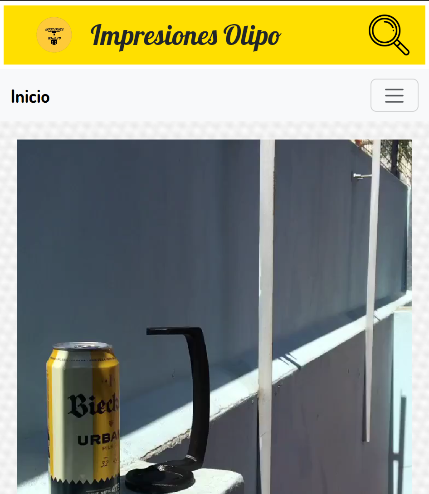

# Proyecto Impresiones Olipo
## Curso 'Desarrollo Web' realizado en Coderhouse


## Descripción del Proyecto

El objetivo de este proyecto fue construir una tienda en línea donde los clientes puedan explorar y comprar productos impresos en 3D. El sitio web incluye varias funcionalidades, como una barra de búsqueda, una galería de productos, una sección de preguntas frecuentes y una página de contacto.
## Tecnologías Utilizadas

En este proyecto, utilicé una variedad de tecnologías y herramientas que aprendí durante el curso:

➡️ **HTML5**: Para estructurar el contenido de la página.

➡️ **CSS3 y SASS**: Para diseñar y estilizar el sitio web, incluyendo el uso de variables, nesting y mixins con SASS.

➡️ **Git y GitHub**: Para el control de versiones y la colaboración.
## Uso

Instrucciones sobre cómo usar el proyecto:

➡️ **Barra de búsqueda**: Permite a los usuarios buscar productos por nombre.

➡️ **Galería de productos**: Muestra todos los productos disponibles con imágenes y descripciones.

➡️ **Sección de preguntas frecuentes**: Proporciona respuestas a las preguntas más comunes sobre envíos y productos.

➡️ **Página de contacto**: Permite a los usuarios ponerse en contacto con nosotros para consultas adicionales.

## Lo que Aprendí
A lo largo del desarrollo de este proyecto, aprendí y apliqué los siguientes conceptos y habilidades:

➡️ **Diseño en cuadrícula (Grid Layout)**: Para organizar los productos en una galería.

➡️ **Flexbox**: Para alinear y distribuir los elementos de manera flexible.

➡️ **Media Queries**: Para hacer que el diseño sea responsive y se vea bien en diferentes dispositivos.

➡️ **Control de versiones con Git**: Para mantener un historial de los cambios y colaborar de manera eficiente.

➡️ **Uso de animaciones**: Se utilizaron animaciones sutiles en elementos puntuales.

## Estructura del Proyecto

El proyecto está organizado de la siguiente manera:

```plaintext
ImpresionesOlipo/
├── index.html
├── css/
│   └── styles.scss
├── js/
│   └── main.js
├── images/
│   └── (imágenes de productos)
└── README.md

